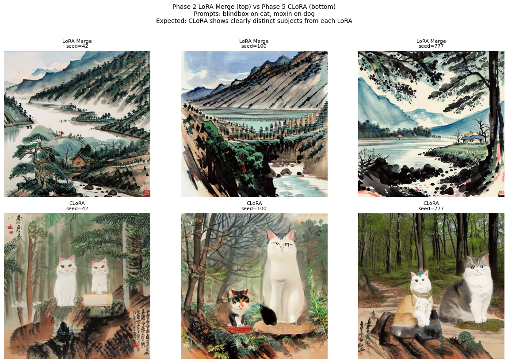
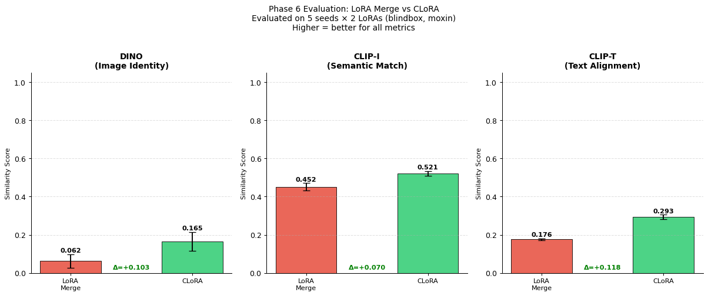
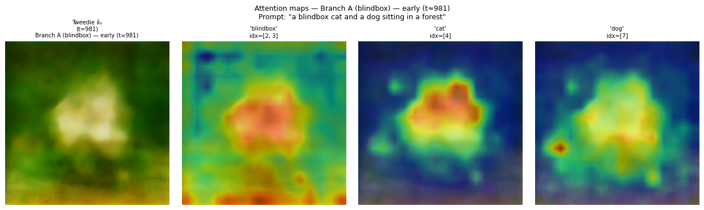
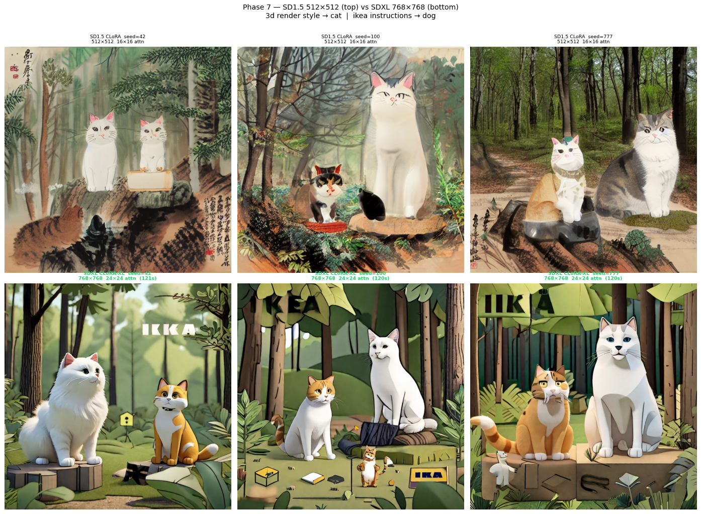

# CLoRA: Test-Time Composition of Multiple LoRAs (SD 1.5 replication + SDXL port)

A from-scratch replication of **CLoRA: Contrastive Test-Time Composition of Multiple LoRA Models for Image Generation** ([Meral, Simsar, Tombari & Yanardag, arXiv:2403.19776](https://arxiv.org/abs/2403.19776)) on Stable Diffusion v1.5, plus an extension of its masked-fusion stage to **Stable Diffusion XL 1.0** ("CLoRA-XL"). Everything runs on Kaggle's free **2× Tesla T4** tier.

> Course project for **CS683: Generative AI**, IIT Mandi, January–May 2026 (Group 45, "Replicate + Improve" track).

<p align="center">
  
  <br><em>Top: naive LoRA Merge collapses into an ink-painting landscape with no subjects. Bottom: CLoRA on the same seeds keeps both subjects in the scene.</em>
</p>

---

## Contents
- [The problem](#the-problem)
- [What was implemented](#what-was-implemented)
- [Results](#results)
- [CLoRA-XL (SDXL extension)](#clora-xl-sdxl-extension)
- [Engineering issues found and fixed](#engineering-issues-found-and-fixed)
- [Limitations (read before citing numbers)](#limitations-read-before-citing-numbers)
- [Repository layout](#repository-layout)
- [How to run](#how-to-run)
- [Team and acknowledgements](#team-and-acknowledgements)

---

## The problem

A LoRA adapter teaches a diffusion model one style or subject. Using **two** LoRAs at once is hard: the naive approach (add both weight deltas, `ΔW = 0.7·B₁A₁ + 0.7·B₂A₂`) usually lets one LoRA dominate, or blends the two into an incoherent image. The paper names two failure modes:

- **Attention overlap**: both LoRAs attend to the same image region, so one concept disappears.
- **Attribute binding**: features from one LoRA bleed onto the other subject.

CLoRA fixes this **at inference time, with no training**, by steering the cross-attention maps of each LoRA towards its own region and then fusing the predictions with spatial masks.

## What was implemented

All three algorithmic components of the paper, written by hand on top of `diffusers` (no CLoRA reference code was used):

| Component | What it does | Notebook |
|---|---|---|
| **Multi-branch denoising** | For N LoRAs, runs N+1 UNet branches per step on a shared latent: a base prompt with no LoRA, plus one prompt per LoRA with that adapter active (`set_adapters` hot-swapping). | Phase 3 |
| **Attention capture** | Custom `CLoRAAttnProcessor` replaces PyTorch SDPA with a manual softmax so the 16×16 cross-attention maps stay in the autograd graph. Installed on all 16 `attn2` layers of the SD1.5 UNet. | Phase 4 |
| **InfoNCE latent update** | Groups attention maps by concept (e.g. `cat` + `blindbox` vs `dog` + `wuchangshuo`), computes a contrastive InfoNCE loss (τ = 0.5), and takes one gradient step on the latent `z_t ← z_t − α_t ∇L` at denoising steps {0, 10, 20}, cutoff 25 of 50. | Phase 5 |
| **Masked latent fusion** | Thresholds each LoRA's attention map (λ = 0.3 × max) into a binary mask and combines branch noise predictions so each LoRA only affects its own region. | Phase 5 |
| **Evaluation** | DINO ViT-S/16 (image–image), CLIP ViT-L/14 image–image (CLIP-I) and image–text (CLIP-T), using the paper's Table 1 protocol: min across LoRAs, then mean ± std across seeds. | Phase 6 |

Every stage has a verification step before the next one is built on it, for example:

- a branch sanity test with no LoRAs
- an adapter-switch L2 diagnostic (base vs blindbox 6.93, base vs moxin 9.41, blindbox vs moxin 10.16)
- an attention-map quality gate (softmax row sums ≈ 1, spatial peakedness > 2.0, cat/dog overlap 0.643 < 0.85)

## Results

**Setup:** SD v1.5, DDIM 50 steps, CFG 7.5, 512×512.
- **LoRAs:** `blindbox` (3D toy style) on the cat and `moxin` (Chinese ink painting, trigger `wuchangshuo`) on the dog.
- **Prompt:** "a cat and a dog sitting together in a forest".
- **Seeds:** 42, 100, 777, 2024, 31337.
- **References:** 16 images generated by each LoRA alone (4 LoRAs × 4 seeds).

### Quantitative (5 seeds, mean ± std, higher is better)

These numbers are copied from the evaluation cell output in the notebook (Phase 6, Cell 46).

| Metric | LoRA Merge | CLoRA (ours) | Paper CLoRA (H100, full benchmark) |
|---|---|---|---|
| DINO min | 0.015 ± 0.028 | **0.124 ± 0.056** | 0.447 ± 0.035 |
| DINO avg | 0.062 ± 0.037 | **0.165 ± 0.049** | 0.554 ± 0.028 |
| DINO max | 0.097 ± 0.043 | **0.195 ± 0.054** | 0.593 ± 0.024 |
| CLIP-I min | 0.432 ± 0.020 | **0.475 ± 0.010** | 0.683 ± 0.017 |
| CLIP-I avg | 0.452 ± 0.019 | **0.521 ± 0.011** | 0.725 ± 0.017 |
| CLIP-I max | 0.478 ± 0.023 | **0.597 ± 0.026** | 0.756 ± 0.017 |
| CLIP-T | 0.176 ± 0.003 | **0.293 ± 0.011** | 0.862 ± 0.052 |

CLoRA beats LoRA Merge on all seven metrics in this setup, which matches the **direction** of the paper's main result. The absolute scores are much lower than the paper's; see [Limitations](#limitations-read-before-citing-numbers).

<p align="center">
  
</p>

### InfoNCE loss during the latent update

The contrastive loss drops between update steps 0 and 20 for every seed (average drop 0.075). For seed 100 it rises slightly at step 10 before falling.

| Seed | Step 0 | Step 10 | Step 20 |
|---|---|---|---|
| 42 | 0.9243 | 0.8965 | 0.7920 |
| 100 | 0.9146 | 0.9248 | 0.8726 |
| 777 | 0.9248 | 0.9136 | 0.8608 |
| 2024 | 0.9180 | 0.9028 | 0.8457 |
| 31337 | 0.9546 | 0.9370 | 0.8896 |

### Cost
| Configuration | Time / image | Hardware |
|---|---|---|
| 3 branches, no latent update | 28.2 s | T4 |
| Full CLoRA (SD1.5) | 34.0 s | T4 |
| CLoRA-XL (SDXL, masked fusion only) | ~120 s | T4 |
| Paper (2 LoRAs) | 25 s | H100 |

### Attention maps

<p align="center">
  
  <br><em>Branch A (blindbox) cross-attention at t ≈ 981: the "blindbox", "cat" and "dog" tokens already attend to different regions at maximum noise.</em>
</p>

## CLoRA-XL (SDXL extension)

The paper only covers SD v1.5. This project ports the **multi-branch + masked-fusion** pipeline to SDXL 1.0.

| | SD 1.5 CLoRA | SDXL CLoRA-XL |
|---|---|---|
| UNet | 860M params | 2,567M params |
| Output | 512×512 | 768×768 |
| Attention grid | 16×16 (256 tokens) | 24×24 (576 tokens) |
| Text encoders | CLIP-L (768d) | CLIP-L + OpenCLIP-G (2048d) |
| Cross-attention layers hooked | 16 | 70 |
| InfoNCE latent update | Yes | **No**: needs ≥ 40 GB VRAM, not possible on a 16 GB T4 |
| Masked fusion | Yes | Yes |
| LoRAs | blindbox, moxin | `goofyai/3d_render_style_xl`, `ostris/ikea-instructions-lora-sdxl` |

<p align="center">
  
  <br><em>Top: SD 1.5 CLoRA (512×512). Bottom: SDXL CLoRA-XL (768×768), seeds 42, 100, 777.</em>
</p>

CLoRA-XL is **masked fusion without the contrastive update**, so it is a partial port. It has no quantitative evaluation, only the three qualitative samples above.

## Engineering issues found and fixed

Running this on 16 GB T4s instead of the paper's 25–80 GB GPUs turned up five problems. Each is documented in the notebook next to its fix:

| # | Symptom | Root cause | Fix |
|---|---|---|---|
| 1 | Disk full while downloading SDXL | `snapshot_download` pulled fp16 **and** fp32 weights in parallel | Sequential `hf_hub_download` of the exact files needed |
| 2 | Blank ~2 KB images | Gradient checkpointing left on during `@torch.no_grad()` inference | Enable checkpointing only inside the latent-update step |
| 3 | Black SDXL images | fp16 VAE overflows at 768×768 → NaN → 0 | `upcast_vae()` to fp32 for decoding, then restore fp16 |
| 4 | RuntimeError / silent NaN | `device_map="balanced"` (accelerate hooks) conflicts with `upcast_vae()` | Load SDXL on a single GPU with `enable_attention_slicing(1)` |
| 5 | Near-zero DDIM updates | UNet output on `cuda:1`, latents on `cuda:0` | Move UNet outputs to the compute device immediately |

Issues 3 and 4 together mean that, in `diffusers 0.31.0`, `device_map="balanced"` cannot be used for SDXL inference that includes VAE decoding.

## Limitations (read before citing numbers)

- **Small evaluation:** 5 seeds and one LoRA pair (blindbox + moxin). The paper evaluates 131 LoRAs × 200 prompts × 10 seeds. Treat the percentage gains as indicative only.
- **Absolute scores are far below the paper's.** These are style LoRAs rather than the paper's subject LoRAs, and the reference images use different prompts from the composition prompt. Both depress DINO and CLIP-I.
- **The subjects are not always correct.** In the CLoRA samples, the second subject is often rendered as a **second cat** rather than a dog, in both SD 1.5 and SDXL. CLoRA clearly fixes the merge baseline's collapse into a subject-less landscape, but it does not fully fix attribute binding in this setup. The SDXL "ikea instructions" LoRA also leaks "IKEA"-like text into the scene.
- **CLoRA-XL has no InfoNCE update** and no quantitative evaluation.
- **Not a packaged library.** The code lives in one Kaggle notebook organised by phase, with "session restore" cells so each phase can be rerun after a kernel restart.

## Repository layout

```
.
├── README.md
├── requirements.txt              # pinned versions used in the notebook
├── notebooks/
│   └── clora_cs683_group45.ipynb # full pipeline, Phases 0–7, with saved outputs
├── docs/
│   ├── CS683_Group45_CLora_Report.pdf        # 24-page project report
│   └── CS683_Group45_CLora_Presentation.pdf  # final presentation
└── results/
    ├── outputs/         # Phase 2 references/triggers, Phase 3 branches, Phase 5 CLoRA, Phase 6 charts
    ├── baselines/       # LoRA Merge baselines (3 LoRA pairs × 4 seeds)
    ├── debug/           # attention maps, quality gate, adapter-switch diagnostic
    └── phase7_outputs/  # CLoRA-XL (SDXL) outputs and SD1.5 vs SDXL comparison
```

### Notebook phases

| Phase | Cells | Content |
|---|---|---|
| 0–1 | 1–8 | Pinned installs; download SD1.5, CivitAI LoRAs, DINO and CLIP; asset inventory |
| 2 | 9–14 | Base generation, trigger-word tests, 16 reference images, LoRA Merge baseline |
| 3 | 15–23 | DDIM pipeline, prompt encoding, token-index finder, multi-branch denoising, adapter-switch diagnostic |
| 4 | 24–31 | Custom attention processor, attention-map capture and visualisation, quality gate |
| 5 | 32–40 | InfoNCE loss, concept groups, latent update, full CLoRA loop, Merge vs CLoRA |
| 6 | 41–49 | DINO/CLIP scoring, results table, bar chart, qualitative grid |
| 7 | 50–56 | SDXL download, single-GPU loading, CLoRA-XL masked fusion, SD1.5 vs SDXL grid |

## How to run

1. Open `notebooks/clora_cs683_group45.ipynb` on **Kaggle** with the **GPU T4 ×2** accelerator and internet on. The paths assume `/kaggle/working`.
2. Run the install cell, **restart the kernel**, then continue from Cell 3. The notebook explains why: a preinstalled `bitsandbytes` breaks the `diffusers` import.
3. *(Optional)* Add a Hugging Face token as a Kaggle secret named `HF_TOKEN`. The public models used here download without one.
4. Run the phases in order. After a kernel restart, run that phase's "session restore" cell first.

Models used:
- **Base models:** `stable-diffusion-v1-5/stable-diffusion-v1-5` and `stabilityai/stable-diffusion-xl-base-1.0`.
- **Evaluation models:** `facebook/dino-vits16` and `openai/clip-vit-large-patch14`.
- **SD1.5 LoRAs:** downloaded from CivitAI by model-version ID, listed in Cell 5. CivitAI version IDs can change.
- **SDXL LoRAs:** downloaded from the Hugging Face Hub.

Key versions: `diffusers 0.31.0`, `transformers 4.46.2`, `peft 0.13.2`, `accelerate 1.1.1`, `safetensors 0.4.5` (see `requirements.txt`).

## Team and acknowledgements

**CS683 Group 45, IIT Mandi:** Akshay Bitlingu, Karthik, Madhu Dheeravath, Devudu.

Thanks to Prof. Parimala for guidance throughout CS683. The project builds on:
- [CLoRA](https://arxiv.org/abs/2403.19776)
- [Attend-and-Excite](https://arxiv.org/abs/2301.13826), the source of the latent-update idea
- [🤗 diffusers](https://github.com/huggingface/diffusers) and [peft](https://github.com/huggingface/peft)
- [DINO](https://arxiv.org/abs/2104.14294)
- [CLIP](https://arxiv.org/abs/2103.00020)
- the CivitAI and Hugging Face LoRA authors credited in the notebook

```bibtex
@article{meral2024clora,
  title   = {Contrastive Test-Time Composition of Multiple LoRA Models for Image Generation},
  author  = {Meral, Tuna Han Salih and Simsar, Enis and Tombari, Federico and Yanardag, Pinar},
  journal = {arXiv preprint arXiv:2403.19776},
  year    = {2024}
}
```
